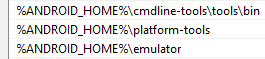

# AppiumLearning

1. Website [SDET Pro](https://sdetpro.com/)
2. Mobile Automation Test with Appium - Mentor [Tu Huynh](https://github.com/sdetpro-blog)

### `tunghuynh` repository

> The repo `tunghuynh` is used to do the Lab in the course

### `refactoring` repository

> The purpose of `refactoring` is to practice multiple solutions differed from the SDET Pro course

### `master` repository

> The purpose of `master` is always updated to `tunghuynh`

## How to run

**PREPARING ENVIRONMENT**

1. Install [Java 8](https://www.oracle.com/java/technologies/downloads/)
    - Setup _JAVA_HOME_
2. Install [Nodejs](https://nodejs.org/en/)
3. Install Appium Server with the following command
    - `npm i appium -g`
4. Install Android Emulator
    - Download [Command line tools only](https://developer.android.com/studio#downloads)
    - For Windows Only:
        - Create folder Android under C drive as `C:\Android\sdk`
        - Setup both _ANDROID_HOME_ and _ANDROID_SDK_ROOT_
    - Use `sdkmanager` from [***cmdline-tools/tool/bin***] to download and install platform-tools and android emulator
        - `sdkmanager platform-tools emulator`
    - Verify installation is success
        - `adb devices`
    - Extend *PATH* to obtain platform-tools, emulator, cmdline-tools/tool/bin
        - 
    - Install Packages for AVD (Android Virtual Device)

> ```json lines
> sdkmanager --list
> sdkmanager "platforms;android-29"
> sdkmanager "system-images;android-29;default;x86"
> sdkmanager "build-tools;29.0.2"
>```

5. Create AVD

> ```json lines
> avdmanager create avd --name android_29 --package "system-images;android-29;default;x86
> ```

6. Launch AVD

> ```json lines
> emulator -avd @avd_name
> or
> emulator @avd_name
> ```

*Clone Source Code*

```commandline
git pull https://github.com/codyhuynh-htt/AppiumLearning.git
```

*Run Regression Test Suite*

```json lines
mvn clean test -Dsurefile.suiteXmlFires="src/test/resources/test-suites/RegressionTest.xml"
```

*Run Smoke Test suite*

```json lines
mvn clean test -Dsurefile.suiteXmlFires="src/test/resources/test-suites/SmokeTest.xml"
```
